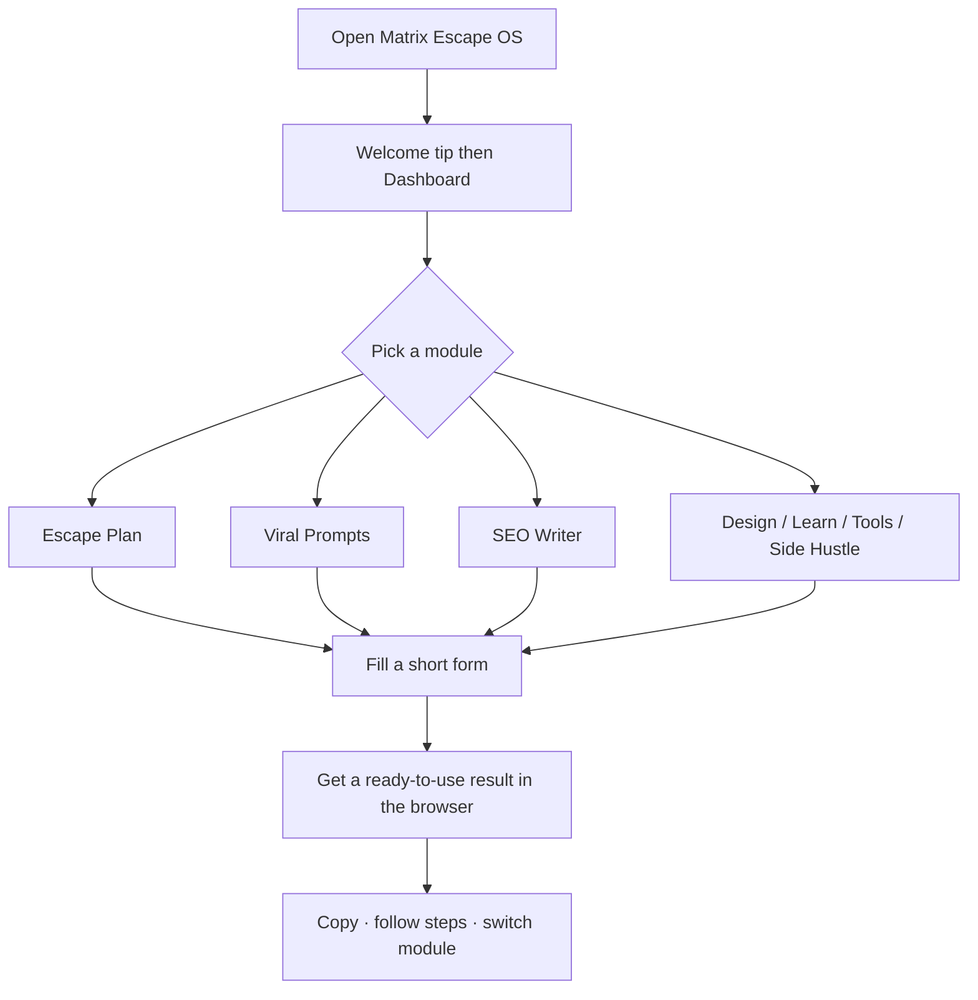
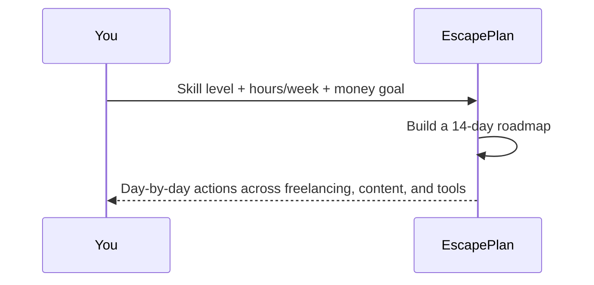

# Matrix Escape OS

**Author:** Hammad Durrani (HDxpert)  
**Live demo:** https://hammad-ml-dev.github.io/Matrix-Escape-OS-Operating-System-for-Hustlers-/

---

## About this tool

**Matrix Escape OS** is a browser “operating system” for people who want to build income online beyond a 9–5. It is **not** a social network and **not** a chat with an API key — it is a **practical toolkit**: you answer a few questions, and each module gives you a plan, prompts, copy, resources, or next steps you can use the same day.

**Tagline:** *You are not stuck — you are untrained. This app is your OS to escape the Matrix.*

**Who it’s for**
- Beginners who need a clear first roadmap  
- Creators who need prompts and SEO drafts fast  
- Recruiters / learners who want a polished product demo with zero setup  

**No login. No backend. No API keys.** Open the link and start.

---

## Modules (what each tool does)

| Module | You give it… | You get back… |
|--------|----------------|---------------|
| **Escape Plan** | Skill, time, money goal | A 14-day action roadmap |
| **Viral Prompts** | Niche / platform | Short-form content prompt packs |
| **SEO Writer** | A topic | Titles, meta ideas, draft copy |
| **Design Toolkit** | A screenshot | Redesign notes + tool links |
| **Learn Escape** | A track (freelance, products, …) | Curated free learning links |
| **Tool Stack** | A category | Free tools worth trying |
| **Side Hustle** | Short quiz answers | Three 7-day starter paths |

---

## How you use the OS



### Example: Escape Plan flow



---

## Try it

1. **Live demo (best first step):** https://hammad-ml-dev.github.io/Matrix-Escape-OS-Operating-System-for-Hustlers-/  
2. **Run locally:**

```bash
git clone https://github.com/hammad-ml-dev/Matrix-Escape-OS-Operating-System-for-Hustlers-.git
cd Matrix-Escape-OS-Operating-System-for-Hustlers-
npm install
npm run dev
```

Or double-click `RUN.bat` on Windows.

---

## Learning path

1. Open the live demo → finish **Escape Plan** end-to-end  
2. Try **Viral Prompts** or **Side Hustle**  
3. Read `src/pages/EscapePlan.tsx` to see how form answers become a plan  

---

## Built with

React · TypeScript · Vite · Tailwind · React Router  

(Details for developers; the product itself needs none of this knowledge to use.)

---

Shared for learning and portfolio demonstration. Please credit **Hammad Durrani**.
